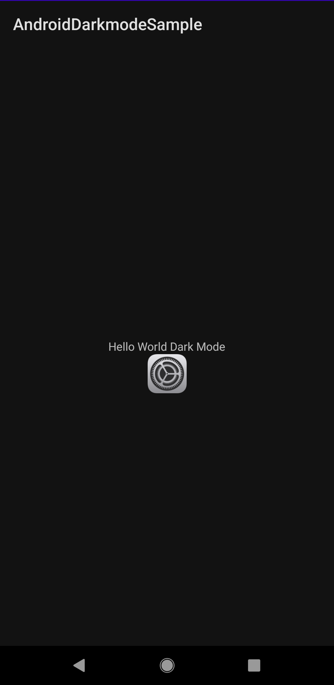
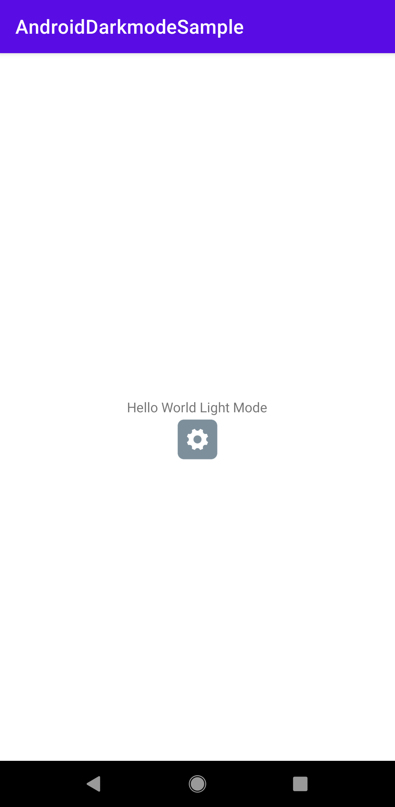

# Androidのダークモードへの対応サンプルプロジェクト

このプロジェクトではAndroidアプリの開発においてダークモードに実際に対応する方法を紹介したサンプルとなるプロジェクトです。

## プロジェクトの動かし方

本リポジトリを `git clone` して、`Android Studio` にてBuildおよび端末にて実行することで確認できます。

## 実行の様子

実際に実行してみたときの様子を以下の表示します。上記プロジェクトを実行してみて試してみてください。

### ダークモードが有効の時のスクリーンショットの様子

### ライトモードが有効の時のスクリーンショットの様子

以上のようにダークモードとライトモードとで表示されている内容が変わっていることが確認することができます。